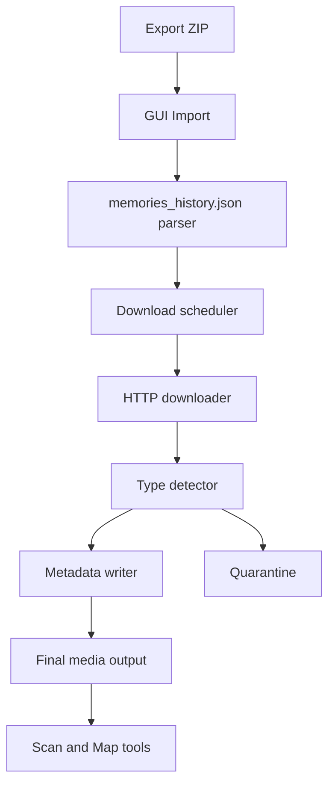
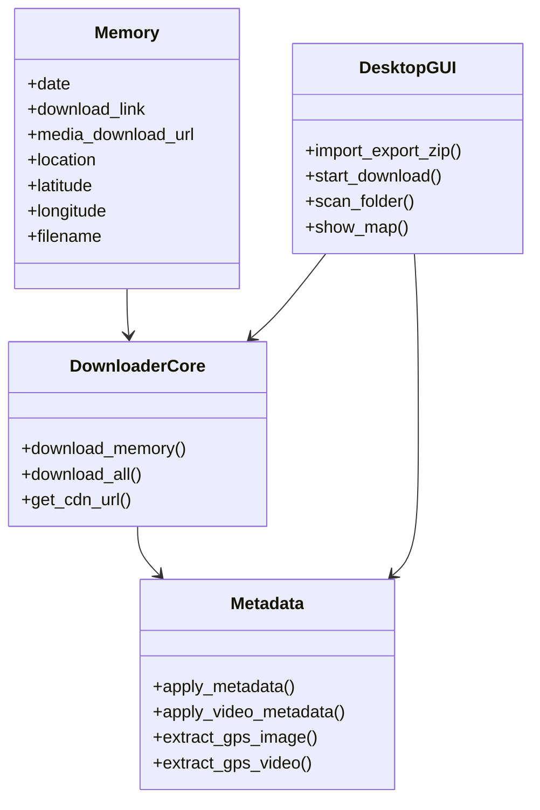

# Snapchat Memories Downloader (SMD)

Download Snapchat Memories exports, fix file extensions, and preserve capture metadata (time + GPS where available).

## What This App Does

- Imports Snapchat export ZIP files and reads `memories_history.json`
- Downloads media with retry logic and duplicate-safe filenames
- Detects real file type from content (not only extension)
- Handles package ZIP media and extracts main media when possible
- Embeds metadata for supported formats:
  - Images: EXIF date + GPS (`.jpg`, `.jpeg`)
  - Video: QuickTime/MP4 tags (`.mp4`, `.mov`)
- Quarantines suspicious tiny files (likely broken/empty response files)
- Scans existing folders for extension/GPS analysis

## Important Notes

- This project is **not affiliated with Snap Inc.**
- This app processes files locally on your machine.
- The app needs internet access only to download your own export media URLs.
- Snapchat `My Eyes Only` content is not downloaded through normal Memories export flow. Move content into Memories first if you need it included.

## Platform Support

- Official target for v1: **Windows 10/11 (64-bit)**
- Python source can run cross-platform, but release QA currently focuses on Windows builds

## Quick Start (User)

**Official release — no extra software needed**

1. Download and run the SMD installer (or unzip the portable `smd` folder).
2. Open **Snapchat Memories Downloader**.
3. Request your Snapchat data export (Memories + JSON).
4. Select the export ZIP (or folder with all ZIP parts).
5. Click Start — processing runs locally on your PC.

No Python, pip, ffmpeg, or other tools required in the official Windows build.

## Build & Release

See **`ALL_IN_ONE_PACKAGING.md`** for the canonical packaging rules (bundle everything; file size is not a concern).

See **`DISTRIBUTION_GUIDE.md`** for the release checklist.

```powershell
powershell -ExecutionPolicy Bypass -File .\build_smd.ps1
```

Output: `dist/smd/smd.exe` (all-in-one portable folder).

## Architecture





## Reliability Roadmap

- **Phase A (stability hardening):** crash fixes, path portability, skip/stat correctness, metadata flow integrity
- **Phase B (safe UX improvements):** clearer status/reporting, better issue summaries, beginner-first wording
- **Phase C (visual polish):** modern UI refinements after behavior is stable

## Security & Trust Checklist (Release)

- Publish SHA-256 checksums for each release binary
- Add clear "no telemetry" statement if you keep that policy
- Add license + trademark notice (name/logo usage policy)
- Consider code signing when budget allows (improves Windows SmartScreen trust)

